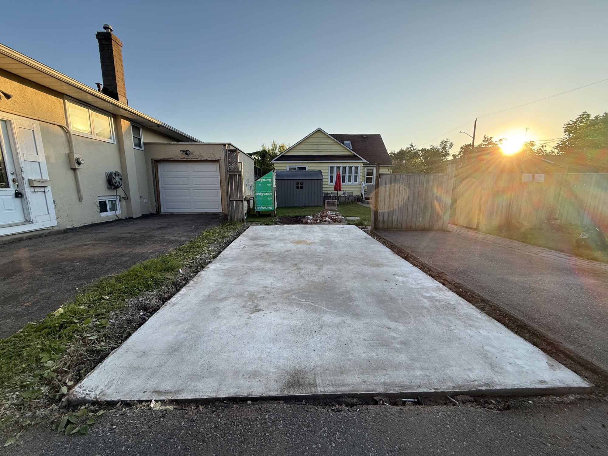

Two weeks ago, I tore down my detached garage. It felt monumental — like the opening act of something big. But in hindsight, demolishing a garage is just clearing the stage. This week, the excavator rolled in. _Now_ construction has truly begun.

In a single day, my backyard — nine years of family life — was transformed into a construction site. Gone are the rose of Sharon, the mulberry tree, the lilac, the campfire pit we gathered around on cool evenings. My kids grew up in that yard. My family made memories there. Watching it disappear under the tracks of an excavator is something I wasn't fully prepared for emotionally, even though I planned this project for months.

But before I get sentimental, let me share three things this first week of excavation taught me — two I never anticipated, and one I had to learn the hard way.

---

## Why Is the Excavation So Much Bigger Than the House?

First, a quick note on why the dig site looks enormous relative to a 600 sq ft ADU.

Passive House slab-on-grade foundations require thick continuous insulation — not just under the slab, but extending **8 feet outward** from the building footprint in all directions. This "wing" of insulation is what prevents thermal bridging at the slab edge and keeps the foundation performing at Passive House levels year-round. The result: the excavation area is dramatically larger than the building itself. My entire backyard is now bare earth. The only things left standing are the main house and a small deck.

If you're planning a Passive House ADU and expecting a modest little dig, prepare for something that looks more like a swimming pool excavation.

---

## Surprise #1: Access to Your Own Home Disappears

Here's something that never crossed my mind during planning: when your entire lot is excavated, _how do you get to your front door?_

My property is unusual — the main house sits at the back of the lot. Once excavation started, every normal path to the entrance became a muddy obstacle course. One rainy afternoon was all it took to understand the problem. Our solution? We cut a hole in the side fence. That's our front door now.

It sounds funny, and honestly, it is a little funny. But it's also a genuine planning gap. If you're building on a tight urban lot, map out your access routes _before_ excavation begins. Think about what happens during rain. Think about delivery trucks, trades arriving early in the morning, and your kids getting home from school. You'll thank yourself later.

---

## Surprise #2: Construction Affects Every Member of Your Family Differently

I'll be direct: I'm energized by this project. The fact that I have the physical capacity, the financial resources, and the time to build a Passive House ADU feels like a genuine privilege. The disruption — the noise, the mud, the workers moving through our space — registers to me as progress.

But that's not how everyone in my household experiences it.

My teenage daughter is embarrassed. She worries about what her friends think when they walk by and see the yard torn up. She worries about debt. My wife feels the loss of privacy acutely — plumbers and electricians have had to come inside the main house to tie in the utilities, and suddenly our home doesn't feel like our sanctuary anymore.

My 11-year-old son, bless him, thinks it's the coolest thing in the world. He watched the excavator work and declared it awesome. I'm grateful for his perspective.

The lesson here isn't about construction — it's about people. If you're the project driver, your enthusiasm can make it easy to overlook how others in your home are coping with the same disruption. Check in with your family. Acknowledge the stress. The project is worth it, but so is the relationship with the people you're building it for.

---

## Hard Lesson: Time Your Material Deliveries

This one I learned the way most builders learn things — by getting it wrong.

My plan was logical: excavate first, then run plumbing and electrical rough-ins, complete gravel base compaction, pass inspections, _then_ receive the foundation insulation. Clean sequencing, no material sitting around in the way.

What actually happened: excavation ran two weeks behind schedule. My ISO slab insulation — a full truckload of large, heavy panels — arrived on time, which meant it arrived _before_ the site was ready for it.

Passive House foundation insulation is not like a pallet of 2x4s you can stack in a corner. The panels are thick, bulky, and heavy. On a small city lot, they consume a significant footprint. I ended up moving them multiple times to make room for the excavator to work — which cost time, labour, and a fair amount of frustration.

**The practical advice:** If you're building a Passive House on a constrained urban lot, secure adequate staging space for your insulation _before_ you order it, or coordinate delivery to arrive precisely when the site is ready to receive it. The insulation is not small. Don't underestimate its physical presence on your job site.

---

## What's Next

Trenching for utilities, plumbing and electrical rough-ins, gravel placement, compaction — and then, finally, insulation installation and the slab pour. Each step is one step closer to a Passive House ADU that will demonstrate what high-performance construction looks like in a real Ontario neighbourhood.

I'll keep sharing what I learn, including the mistakes. Especially the mistakes.

If you're thinking about building a Passive House, follow along with the Namuhaus build.

---

_Namuhaus is Unityhaus's first Passive House ADU, currently under construction in Oshawa, Ontario (Climate Zone 6). It serves as a live proof of concept for high-performance, panelized homebuilding._